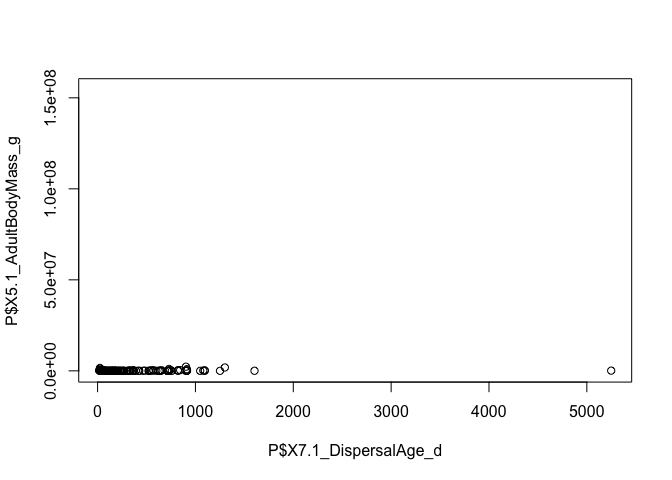

REU\_R\_2018\_workshop\_3
================
Ilya
7/2/2018

##### read in data

``` r
#####read in PanTHERIA data (source: http://esapubs.org/archive/ecol/e090/184/#data) 
P <- read.csv("PanTHERIA_1-0_WR05_Aug2008.csv", header=TRUE)
```

##### replace -999 with NA

``` r
#replace
P = replace(P, P==-999, NA)
```

##### plot continuous data as scatterplot

``` r
plot(P$X7.1_DispersalAge_d, P$X5.1_AdultBodyMass_g)
```



##### plot customization: add axis titles

``` r
plot(P$X7.1_DispersalAge_d, P$X5.1_AdultBodyMass_g, 
     xlab = "Dispersal age (days)",
     ylab = "Adult body mass (g)")
```


##### plot customization: log scale

``` r
#this Stack Overflow thread goes over how to change how numbers appear; one option is to change options(scipen=X)
#https://stackoverflow.com/questions/5963047/do-not-want-scientific-notation-on-plot-axis
options(scipen=5)
plot(P$X7.1_DispersalAge_d, P$X5.1_AdultBodyMass_g, 
     xlab = "Dispersal age (days)",
     ylab = "Adult body mass (g)",
     log = "xy")
```


##### plot customization: log scale

``` r
options(scipen=5)#change scientific to decimal
plot(P$X7.1_DispersalAge_d, P$X5.1_AdultBodyMass_g, 
     xlab = "Dispersal age (days)",
     ylab = "Adult body mass (g)",
     log = "xy",
     col = "red")
```


##### plot customization: add title using "main"

``` r
options(scipen=5)#change scientific to decimal
plot(P$X7.1_DispersalAge_d, P$X5.1_AdultBodyMass_g, 
     xlab = "Dispersal age (days)",
     ylab = "Adult body mass (g)",
     log = "xy",
     col = "red",
     main = "Relationship between dispersal age and body mass")
```


##### plot customization: change shape and size of points

``` r
options(scipen=5)#change scientific to decimal
plot(P$X7.1_DispersalAge_d, P$X5.1_AdultBodyMass_g, 
     xlab = "Dispersal age (days)",
     ylab = "Adult body mass (g)",
     log = "xy",
     col = "red", pch = 17, cex = 1.5,#pch: shape; cex: size
     main = "Relationship between dispersal age and body mass")
```


##### plot customization: multiple plots per window

``` r
options(scipen=5)#change scientific to decimal
# specify (n.rows, n.columns)
par(mfrow = c(1, 2))  #one row, two columns
plot(P$X7.1_DispersalAge_d, P$X5.1_AdultBodyMass_g, 
     xlab = "Dispersal age (days)",ylab = "Adult body mass (g)",
     log = "xy", col = "red", pch = 17, cex = 1.5,#pch: shape; cex: size
     main = "Relationship between dispersal age and body mass")
plot(P$X5.1_AdultBodyMass_g, P$X7.1_DispersalAge_d, 
     ylab = "Dispersal age (days)", xlab = "Adult body mass (g)",
     log = "xy", col = "blue", pch = 17, cex = 1.5,#pch: shape; cex: size
     main = "Relationship between dispersal age and body mass")
```


#### Statistical analysis: linear regression

``` r
my.model <- lm(log(X5.1_AdultBodyMass_g) ~ log(X7.1_DispersalAge_d), data = P)
summary(my.model)
```

    ## 
    ## Call:
    ## lm(formula = log(X5.1_AdultBodyMass_g) ~ log(X7.1_DispersalAge_d), 
    ##     data = P)
    ## 
    ## Residuals:
    ##     Min      1Q  Median      3Q     Max 
    ## -5.6988 -1.7674 -0.4663  1.8318  6.2685 
    ## 
    ## Coefficients:
    ##                          Estimate Std. Error t value      Pr(>|t|)    
    ## (Intercept)                6.5682     1.0338   6.353 0.00000000276 ***
    ## log(X7.1_DispersalAge_d)   0.4559     0.1867   2.442        0.0159 *  
    ## ---
    ## Signif. codes:  0 '***' 0.001 '**' 0.01 '*' 0.05 '.' 0.1 ' ' 1
    ## 
    ## Residual standard error: 2.538 on 140 degrees of freedom
    ##   (5274 observations deleted due to missingness)
    ## Multiple R-squared:  0.04085,    Adjusted R-squared:  0.034 
    ## F-statistic: 5.963 on 1 and 140 DF,  p-value: 0.01586

##### Add line representing linear model

``` r
# don't forget to reset your graphical parameters
par(mfrow = c(1, 1))

plot(P$X7.1_DispersalAge_d, P$X5.1_AdultBodyMass_g, 
     xlab = "Dispersal age (days)",ylab = "Adult body mass (g)",
     log = "xy", col = "red", pch = 17, cex = 1.5,#pch: shape; cex: size
     main = "Relationship between dispersal age and body mass")

# adds a line over the scatterplot
abline(my.model)

# adds text at location (x,y) on plot
text(1000, 100, labels = "R-squared = 0.02349")
text(1000, 20, labels = "p-value = 0.0686")
```


